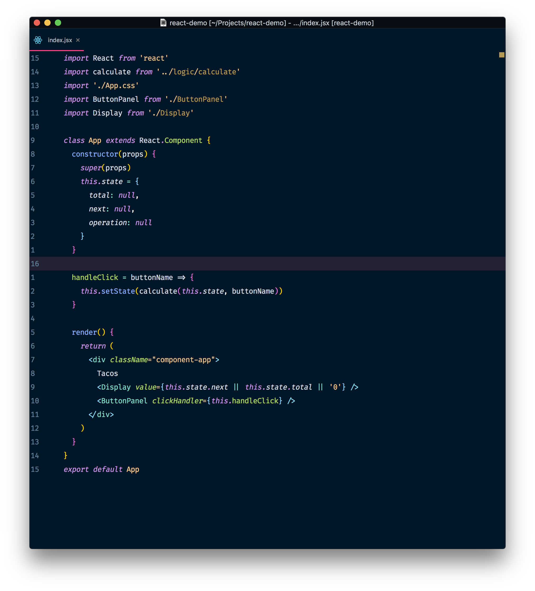
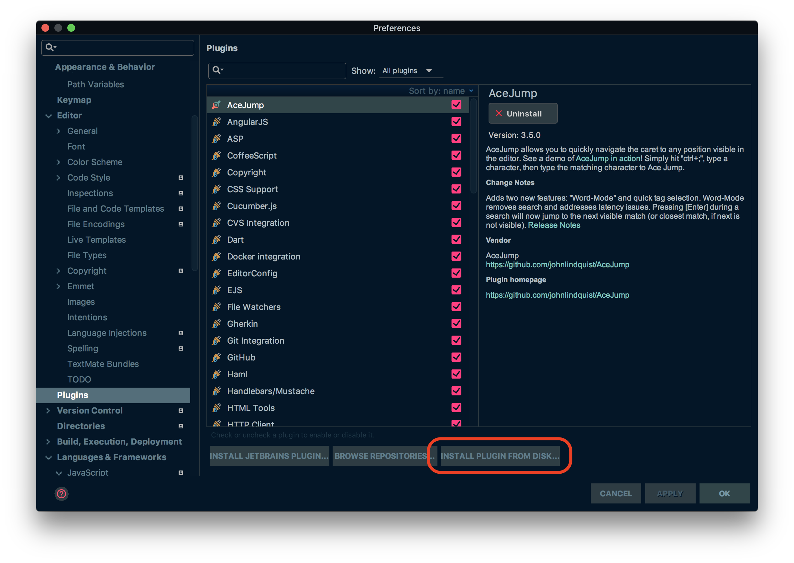

# Night Owl Color Scheme (for Jetbrains® IDEs) 🌌  

> Night owl *theme* and *colour scheme* for IntelliJ® and Webstorm® :jack_o_lantern:

Adaption of [Sarah Drasner's Night Owl](https://marketplace.visualstudio.com/items?itemName=sdras.night-owl) VSCode theme for Webstorm® and IntelliJ® based on [Material UI Jetbrains](https://github.com/ChrisRM/material-theme-jetbrains) and [Rainbow Brackets](https://github.com/izhangzhihao/intellij-rainbow-brackets). Due to the *syntax highlighting* for Jetbrains® IDE's being slightly different, the highlighting won't 100% reproduce that of the VS Code plugin, but it's very similar. You can [vote](https://youtrack.jetbrains.com/issue/IDEABKL-5473) to help with this.

Screenshot: *Webstorm 2018.1* on *macOS Sierra*

Screenshot font: **Fira Code 14pt *(+font ligatures)***

### Support

So far there is support for Javascript, Typescript with React and Angular, feel free to PR for more :smile:

- [x] Javascript
- [x] ReactJS
- [x] Typescript
- [x] Angular
- [x] Java
- [ ] Python
- [ ] Vue
- [ ] SCSS
- [ ] Other languages

### Installation

Installation is not the easiest, due to Jetbrains Material UI not having released custom theme imports yet. If you find a simpler way of installing this you are more than welcome to PR. :star2:

1. Install [Material Theme UI](https://plugins.jetbrains.com/plugin/8006-material-theme-ui)  and [Rainbow Brackets](https://plugins.jetbrains.com/plugin/10080-rainbow-brackets) by going to `Preferences` under `Plugins` and click `Browse Repositories`, to search and install  (**Preferences** > **Plugins** > **Browse Repositories**)

    

2. Go to **Tools** > **Material Theme** > **Material Theme Chooser** >  **Palenight Theme** (to trigger dark config)

3. **Restart** your IDE

4. [Download](https://github.com/xdrop/night-owl-jetbrains/releases) the latest release (zip) and unzip

5. Copy `Material Night Owl.icls` to your IntelliJ® or Webstorm® `colors` folder in the settings directory 

    - `C:\Users\<User>\.<IntelliOrWebstormJDirectory>\config\colors` (Windows)
    - `~/Library/Preferences/IntelliJIdeaOrWebstormXXXX.X/colors/` (macOS)
    - `~/.<IntelliJOrWebstormDirectory>/config/colors/` (Linux)

6. Paste (and replace) `rainbow_brackets.xml` , `material_theme.xml`, `material_custom_theme.xml` under:

    - `C:\Users\<User>\.<IntelliOrWebstormJDirectory>\config\options` (Windows)
    - `~/Library/Preferences/IntelliJIdeaOrWebstormXXXX.X/options/` (macOS)
    - `~/.<IntelliJOrWebstormDirectory>/config/options/` (Linux)
    - **Note**: If there wasn't a `rainbow_brackets.xml` there already then you didn't restart. Make sure you do before pasting

7. **Restart** your IDE

8. Set **Preferences** > **Appeareance & Behaviour** > **Material Theme** > **Tab Height** > **42**

9. **Preferences** > **Editor** > **Color Scheme** > **Material Night Owl**

10. Turn off code folding outline : **Editor** > **General** > **Code Folding** > **Show code folding outline** (off)

11. Turn off indent guides: **Editor** > **General** > **Show indent guides** (off)

12. Turn off breadcrumbs: **Editor** > **General** > **Show breadcrumbs** (off) 

13. Hide toolbars: **View** > (**Toolbar, Tool buttons, Status Bar, Navigation Bar**) > **Untick all**

14. Restart one last time and you are done!

Adjust as needed from Material UI settings in Preferences, or adjust colors from Color Scheme in Preferences.

### Credits

- [Night Owl](https://marketplace.visualstudio.com/items?itemName=sdras.night-owl)

- [Material UI Jetbrains](https://github.com/ChrisRM/material-theme-jetbrains)

- [Rainbow Brackets](https://github.com/izhangzhihao/intellij-rainbow-brackets)

### Trademarks

Jetbrains®, IntelliJ®, Webstorm® are trademarks of their respective owners. Use of them does not imply any affiliation with or endorsement by them. 

### License

Copyright 2018 xdrop

Permission is hereby granted, free of charge, to any person obtaining a copy of this software and associated documentation files (the "Software"), to deal in the Software without restriction, including without limitation the rights to use, copy, modify, merge, publish, distribute, sublicense, and/or sell copies of the Software, and to permit persons to whom the Software is furnished to do so, subject to the following conditions:

The above copyright notice and this permission notice shall be included in all copies or substantial portions of the Software.

THE SOFTWARE IS PROVIDED "AS IS", WITHOUT WARRANTY OF ANY KIND, EXPRESS OR IMPLIED, INCLUDING BUT NOT LIMITED TO THE WARRANTIES OF MERCHANTABILITY, FITNESS FOR A PARTICULAR PURPOSE AND NONINFRINGEMENT. IN NO EVENT SHALL THE AUTHORS OR COPYRIGHT HOLDERS BE LIABLE FOR ANY CLAIM, DAMAGES OR OTHER LIABILITY, WHETHER IN AN ACTION OF CONTRACT, TORT OR OTHERWISE, ARISING FROM, OUT OF OR IN CONNECTION WITH THE SOFTWARE OR THE USE OR OTHER DEALINGS IN THE SOFTWARE.
