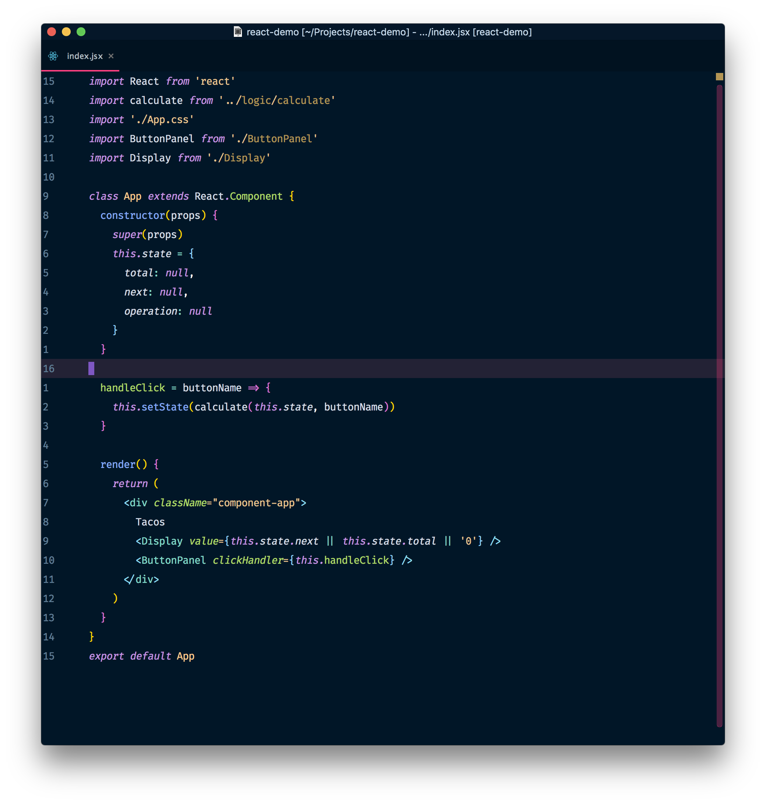

<h1>Night Owl</h1>

> Night owl *theme* and *colour scheme* for IntelliJ®, Webstorm® and other Jetbrains® IDEs :jack_o_lantern:

Adaption of [Sarah Drasner's Night Owl](https://marketplace.visualstudio.com/items?itemName=sdras.night-owl) VSCode theme for Webstorm® and IntelliJ® based on [Material UI Jetbrains](https://github.com/ChrisRM/material-theme-jetbrains) and [Rainbow Brackets](https://github.com/izhangzhihao/intellij-rainbow-brackets). Due to the *syntax highlighting* for Jetbrains® IDE's being slightly different, the highlighting won't 100% reproduce that of the VS Code plugin, but it's very similar. You can [vote](https://youtrack.jetbrains.com/issue/IDEABKL-5473) to help with this.

Screenshot: *Webstorm 2018.2* on *macOS Sierra*

Screenshot font: **Fira Code 14pt *(+font ligatures)***

### Support

So far there is support for Java, Python, Javascript, PHP, Typescript with React and Angular, feel free to PR for more :smile:

- [x] Javascript
- [x] ReactJS
- [x] Typescript
- [x] Angular
- [x] Java
- [x] Python
- [x] PHP
- [ ] Vue
- [ ] SCSS
- [ ] Other languages

### Installation

The plugin is now available on the Jetbrains plugin repository :star2:. **Before installing ensure that Material Theme UI and Rainbow Brackets** are both installed 
1. Install [Material Theme UI](https://plugins.jetbrains.com/plugin/8006-material-theme-ui)  and [Rainbow Brackets](https://plugins.jetbrains.com/plugin/10080-rainbow-brackets) by going to `Preferences` under `Plugins` and click `Browse Repositories`, to search and install  (**Preferences** > **Plugins** > **Browse Repositories**)

    

2. Install [Night Owl Theme](https://plugins.jetbrains.com/plugin/10936-night-owl-theme) in the same way

3. **Restart** your IDE

4. Activate by going to **Tools** > **Material Theme** > **Material Theme Chooser** > **External Themes** >  **Night Owl Theme** 

Adjust as needed from Material UI settings in Preferences, or adjust colors from Color Scheme in Preferences.

### Curent Themes

- Night Owl
- Night Owl Carbon
- Light Owl

### Colour Scheme Only

A colour scheme only release (theme not included) can be found under [Releases](https://github.com/xdrop/night-owl-jetbrains/releases)

### Credits

- [Night Owl](https://marketplace.visualstudio.com/items?itemName=sdras.night-owl)

- [Material UI Jetbrains](https://github.com/ChrisRM/material-theme-jetbrains)

- [Rainbow Brackets](https://github.com/izhangzhihao/intellij-rainbow-brackets)

### Trademarks

Jetbrains®, IntelliJ®, Webstorm® are trademarks of their respective owners. Use of them does not imply any affiliation with or endorsement by them. 

### License

Copyright 2018 xdrop

Permission is hereby granted, free of charge, to any person obtaining a copy of this software and associated documentation files (the "Software"), to deal in the Software without restriction, including without limitation the rights to use, copy, modify, merge, publish, distribute, sublicense, and/or sell copies of the Software, and to permit persons to whom the Software is furnished to do so, subject to the following conditions:

The above copyright notice and this permission notice shall be included in all copies or substantial portions of the Software.

THE SOFTWARE IS PROVIDED "AS IS", WITHOUT WARRANTY OF ANY KIND, EXPRESS OR IMPLIED, INCLUDING BUT NOT LIMITED TO THE WARRANTIES OF MERCHANTABILITY, FITNESS FOR A PARTICULAR PURPOSE AND NONINFRINGEMENT. IN NO EVENT SHALL THE AUTHORS OR COPYRIGHT HOLDERS BE LIABLE FOR ANY CLAIM, DAMAGES OR OTHER LIABILITY, WHETHER IN AN ACTION OF CONTRACT, TORT OR OTHERWISE, ARISING FROM, OUT OF OR IN CONNECTION WITH THE SOFTWARE OR THE USE OR OTHER DEALINGS IN THE SOFTWARE.
